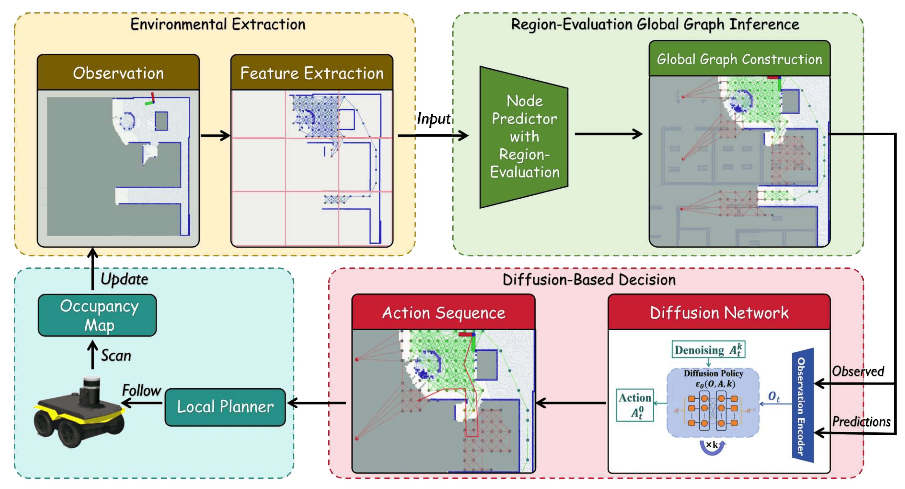
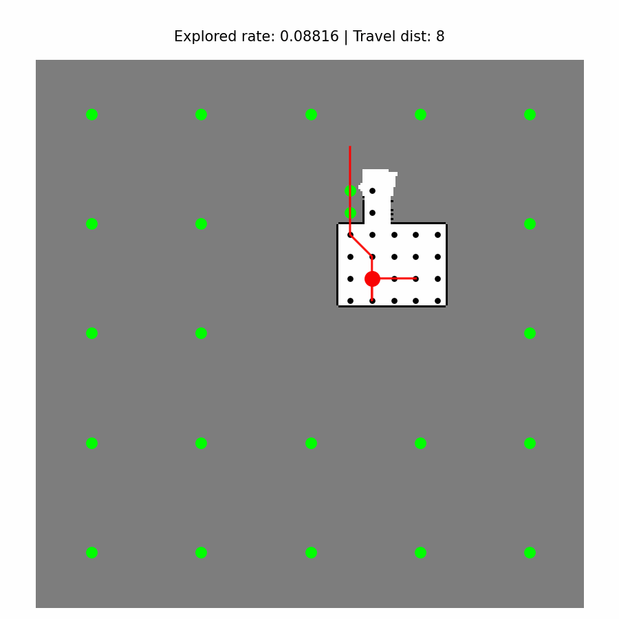
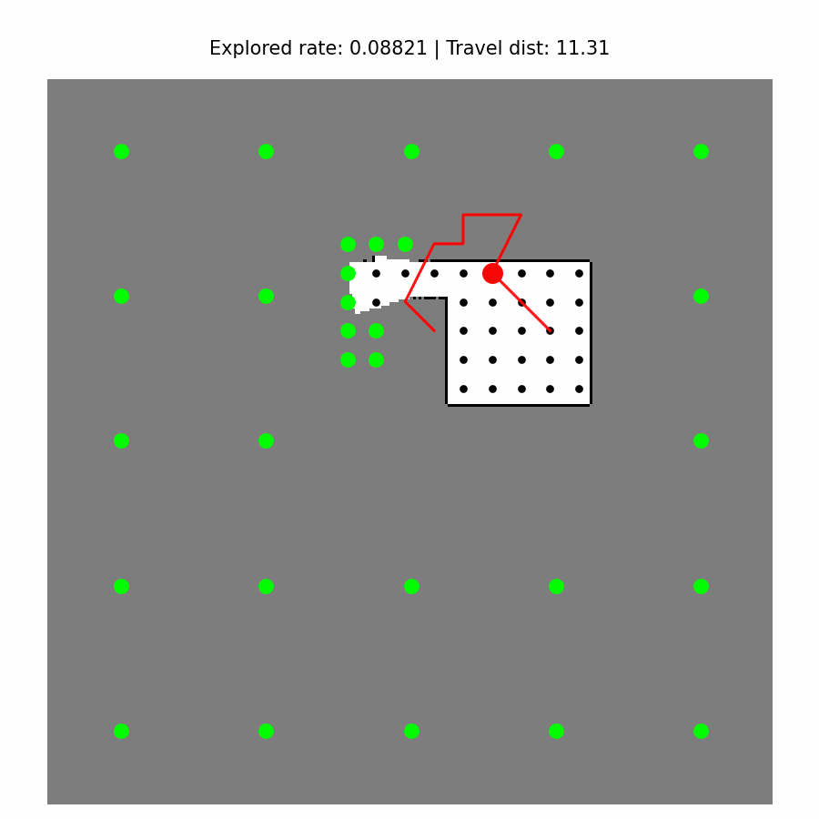

<div align="center">

# GUIDE: A Diffusion-Based Autonomous Robot Exploration Framework Using Global Graph Inference

### A Global Graph Inference and Diffusion-Based Framework for Autonomous Robot Exploration

**Zijun Che<sup>*</sup>**, **Yinghong Zhang<sup>*</sup>**,  
**Shengyi Liang**, **Boyu Zhou**, **Jun Ma**, **Jinni Zhou<sup>†</sup>**

<sup>*</sup> Equal Contribution &nbsp;&nbsp;&nbsp;
<sup>†</sup> Corresponding Author

[](https://arxiv.org/abs/2509.19916)

[](https://youtu.be/9uocwNIdUkU?feature=shared)

</div>

---

## :memo: Paper

This is a novel exploration framework that synergistically combines global graph inference with diffusion-based decision-making.

This work has been accepted by the **IEEE International Conference on Robotics and Automation (ICRA) 2026**.

<p align="center">
   
</p>

**Paper link:** https://arxiv.org/abs/2509.19916

---

## 🎮: DEMO

The following demo shows the proposed GUIDE framework performing long-horizon autonomous exploration in complex environments using diffusion-based global graph inference.

<p align="center">
   
  
</p>

---
## :rocket: Code Release


## 1. Installation
Create conda environment from `environment.yml`
```
conda env create -f environment.yml
```

Activate the environment

```
conda activate GUIDE
```
## 2. LAMA Training

We use a fine-tuned LAMA model for scene completion and inpainting during exploration.

The original LAMA implementation can be downloaded from: [LAMA](https://github.com/advimman/lama).

Please follow the official instructions to install dependencies and prepare the pretrained/fine-tuned checkpoints.

Transfer `lama_server.py` from:

```bash
GUIDE/lama_server/
```

to:

```bash
/lama/bin/
```


## 3. Diffusion Training

### Dataset Collection

Start the LAMA server
Utilizing the trained LAMA model, start the LAMA server


```
cd lama
```

```
PYTHONPATH=. python bin/lama_server.py \
model.path=./lama/e1/che \
model.checkpoint=./lama/e1/che/models/last.ckpt \
out_key=inpainted
```

Modify `dataset_parameter.py` to fit your dataset needs.

Run `dataset_driver.py`
```
python dataset_driver.py
```

Dataset will be saved to directory `diffusion_exploration/dataset/name_of_test`.
It will include a `data.zarr` directory which contains the dataset and a `gifs` directory.

### Running the Training Script
Copy desired training config file from `diffusion_exploration/diffusion_policy/config`

Modify desired task config file from `diffusion_exploration/diffusion_policy/config/task`
**Note:** You probably should modify the `zarr_path` to change dataset location

You can run the training script which requires two arguements:
1. `--config-dir` which is the directory to find the config file
2. `--config-name` which is the name of the config file

Example:
```
python train.py --config-dir=. --config-name=train_exploration_transformer_node_discrete.yaml
```

This will create a directory `diffusion_exploration/data/date/time/name_of_run`

## 4. Test

Start the LAMA server
```
cd lama
```

```
PYTHONPATH=. python bin/lama_server.py \
model.path=./lama/e1/che \
model.checkpoint=./lama/e1/che/models/last.ckpt \
out_key=inpainted
```

Run `test_driver.py`
```python test_driver.py```

Test results will be printed on terminal and saved as a CSV
`inference_gifs` directory will be created in `diffusion_exploration/data/date/time/name_of_run`.

---

## :star: Credit

If you find this work useful, please consider citing us:

+ GUIDE: A Diffusion-Based Autonomous Robot Exploration Framework Using Global Graph Inference

```bibtex
@article{che2025guide,
  title={GUIDE: A Diffusion-Based Autonomous Robot Exploration Framework Using Global Graph Inference},
  author={Che, Zijun and Zhang, Yinghong and Liang, Shengyi and Zhou, Boyu and Ma, Jun and Zhou, Jinni},
  journal={arXiv preprint arXiv:2509.19916},
  year={2025}
}
```

Thanks to the [DARE](https://github.com/marmotlab/DARE)  and [LAMA](https://github.com/advimman/lama) for their support and open-source contributions.

